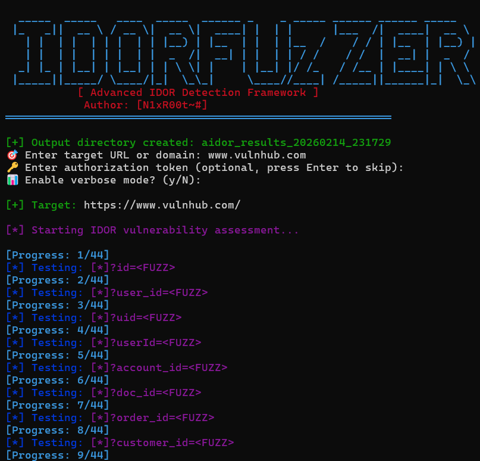

# IDORFUZZER - Advanced IDOR Scanner

> Enterprise-grade IDOR vulnerability detection tool for authorized penetration testing

[](LICENSE)
[](https://github.com)

---


<p align="center">
  
</p>

## 🚀 Quick Start

```bash
chmod +x idorfuzzer.sh
./idorfuzzer.sh
```

---

## ✨ Features

- ✅ **Smart Endpoint Discovery** - Auto-detects vulnerable API routes
- ✅ **Multi-Payload Testing** - Numeric, UUID, String, Encoded, Special chars
- ✅ **Anomaly Detection** - Response size & pattern analysis
- ✅ **Detailed Reporting** - CRITICAL/HIGH/MEDIUM severity classification
- ✅ **Evidence Collection** - Auto-saves proof of vulnerabilities
- ✅ **Authorization Support** - Bearer token authentication
- ✅ **Verbose Mode** - Detailed output for debugging

---

## 📋 Requirements

```bash
# Install dependencies
sudo apt install curl grep sed jq parallel
```

**Dependencies:**
- `curl` - HTTP requests
- `grep` - Pattern matching
- `sed` - Text processing
- `jq` - JSON parsing
- `parallel` - Multi-threading (optional)

---

## 🎯 Usage

### Basic Scan
```bash
./idorfuzzer.sh
# Enter target: https://example.com
```

### With Authentication
```bash
# The script will prompt for:
# 1. Target URL
# 2. Auth token (optional)
# 3. Verbose mode (y/N)
```

---

## 📊 Output Structure

```
aidor_results_YYYYMMDD_HHMMSS/
├── logs/              # Detailed scan logs
├── reports/           # Vulnerability reports
│   └── vulnerabilities.txt
├── evidence/          # Response captures
└── FINAL_REPORT.txt   # Executive summary
```

---

## 🔍 What It Tests

### Endpoints
- `/api/v1/users`, `/api/user`, `/profile`
- `/api/documents`, `/api/invoices`, `/api/orders`
- `/api/messages`, `/api/accounts`, `/api/admin`

### Parameters
- `id`, `user_id`, `uid`, `userId`
- `account_id`, `doc_id`, `order_id`
- `customer_id`, `file_id`, `message_id`

### Payloads
- **Numeric:** `0, 1, 10, 100, 999, -1`
- **UUID:** `00000000-0000-0000-0000-000000000000`
- **String:** `admin, root, user, guest, null`
- **Encoded:** `MQ==, YWRtaW4=` (Base64)
- **Special:** `../1, 1', 1"--`

---

## 🎨 Example Output

```
[*] Testing: api/user?id=<FUZZ>
  [🚨 CRITICAL VULNERABILITY]
    URL: https://target.com/api/user?id=100
    Payload: 100 | Status: 200 | Size: 1523 bytes
    └─ Sensitive data exposed
    └─ User data accessible
```

---

## ⚠️ Detection Logic

**CRITICAL** - Sensitive data patterns found:
- `email`, `password`, `token`, `api_key`, `secret`, `ssn`, `credit_card`

**HIGH** - User-specific data accessible:
- `user_id`, `username`, `first_name`, `last_name`, `address`, `phone`

**MEDIUM** - Response anomalies:
- Size difference ±20% from baseline
- Unexpected JSON structure

---

## 🛡️ Legal Notice

```
⚠️  FOR AUTHORIZED TESTING ONLY

✓ Bug bounty programs
✓ Written permission required
✓ Responsible disclosure

✗ Unauthorized testing is ILLEGAL
```

**Laws:**
- 🇵🇰 Pakistan: PECA 2016 (3 years + fine)
- 🇺🇸 USA: CFAA (10 years prison)
- 🇪🇺 EU: Computer Misuse Acts (heavy fines)

---

## 📚 Resources

- **OWASP Testing Guide:** [Link](https://owasp.org/www-project-web-security-testing-guide/)
- **PortSwigger Academy:** [Link](https://portswigger.net/web-security/access-control/idor)
- **Bug Bounty Platforms:** HackerOne, Bugcrowd, Intigriti

---

## 🔧 Configuration

Edit these variables in the script:

```bash
OUTPUT_DIR="aidor_results_$(date +%Y%m%d_%H%M%S)"
THREADS=5
TIMEOUT=10
USER_AGENT="AIDOR-Scanner/2.0 (Security Research)"
```

---

## 💡 Tips

1. **Always verify manually** with Burp Suite or ZAP
2. **Start with passive recon** before active scanning
3. **Use multiple accounts** to test authorization
4. **Document everything** for bug bounty reports
5. **Respect rate limits** to avoid bans

---

## 📝 Reporting Template

```markdown
## IDOR Vulnerability

**Severity:** HIGH
**Endpoint:** /api/user?id=
**Impact:** Unauthorized access to user data

### Steps to Reproduce:
1. Login as User A
2. Access: /api/user?id=100
3. Change to: /api/user?id=101
4. Observe User B's data

### Proof:
[Screenshot/Evidence]
```

---

## 🤝 Contributing

For improvements or bug reports:
- Create detailed issue reports
- Include reproduction steps
- Attach scan outputs

---

## 👤 Author

- [N1xR00t~#]

*For educational and authorized security testing only*

---

## 📄 License

MIT License - See LICENSE file for details

---

## 🔗 Related

- [IDOR Complete Guide](IDOR_Complete_Guide.md) - Comprehensive IDOR documentation
- [OWASP IDOR](https://owasp.org/www-community/attacks/Insecure_Direct_Object_References)

---
